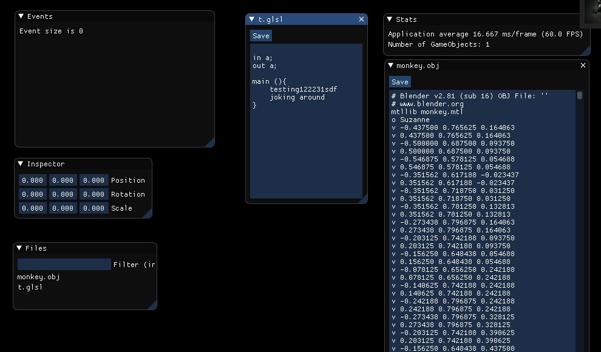
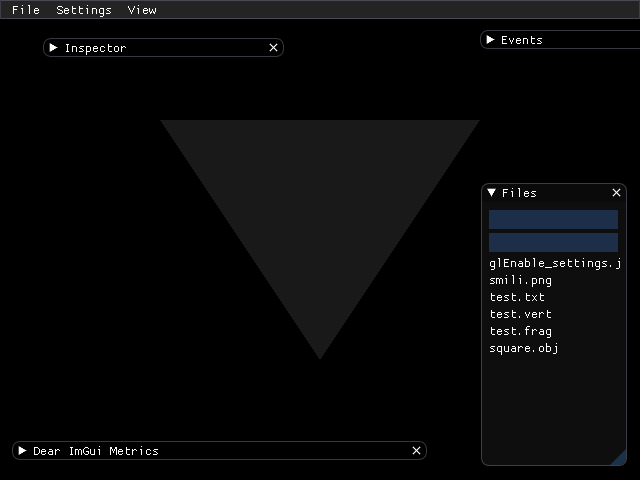
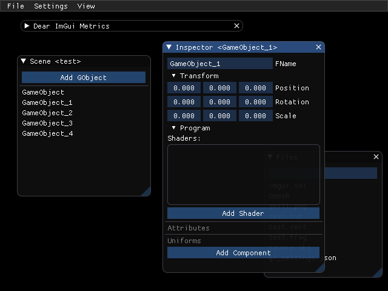
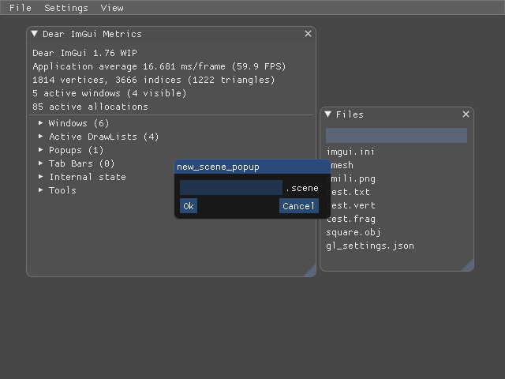
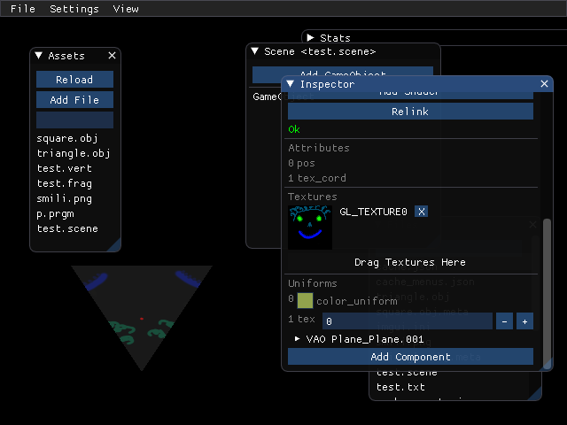
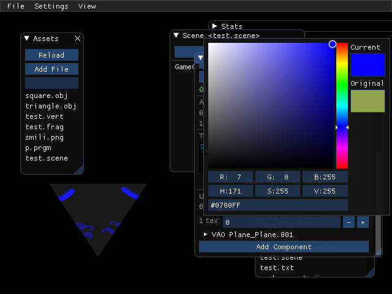

<h1 align="center">Glorious C++ Engine</h1>

I've been meaning to make my own game engine for years now. Ever since using Unity3D I've always felt like I needed more control. This project is the answer to that:

Summing up all my knowledge of C++ over the years. This engine will stitch up multiple libries like *SDL2, Assimp, Cereal, SOIL* as well as the OpenGL loader *Glad* to create a simple but powerful game creation platform that suits my purposes. It will be a colossal task and an equaly immense learning oportunity.

One of the things I aim to overcome is my utter lack to plan ahead and set goals. I shall be tackling that issue with text file `idea.txt` and the various planning tools Github has to offer, **Projects**,  **Issues**, **Pull Requests**, and **Branches**. I will, define a feature to implement in Projects, order by time estimated, then execute based on the most critical feature needed.

 

Engine Compiling
--------
- LINUX
  - Run `./config.sh` to install dependencies
  - Run `./build.sh` to compile the engine
  - Run (pptionally) `./copytestgame.sh` to duplicate the test game project folder
  - Run `./build/engine game0` (or `./build/engine game1` if you chose to copy the base game) to launch the engine
	
- WINDOWS
  - Not available yet

- MAC
  - Not available yet

Game Compiling
---------
- Linux (x86_64)
  - Not yet

- Android (armv7, etc...)
  - Download NDK and Android SDK 16 and modify `extern/sdl2-src/android-project/local.properties` to point to them. (This is 4Gb last time I downloaded it all)
  - Make sure you have the Java SDK installed for your machine. (optionally, if gradlew asks for it, point the enviroment vairable to the right folder).
  - Run Gradlew -> `extern/sdl2-src/android-project/gradlew` with the, (I belive) `installDebug` argument. This will install the game to your phone

- Windows
  - Not available yet
  
- Mac
  - Not available yet

Progress
-------

<b>Day 1</b>

<b>Day 3</b>

<b>Day 10</b>

Trying to get the textures working: 

<b>Day 25</b>

Now compiles for Ubuntu 18.04 as well as Archlinux and is configurable to use OpenGL Core 3.0 or 4.5:

|Main | New Scene|
:----:|:---------:
| |  |

<b>Day 30</b>

<b>Day 33</b>

<b>Day 49</b>

A huge range of improvement from serailizing to getting the textures finally working. As well as dynamic project reloading:

|Textures | Color Edit|
:----:|:---------:
| |  |

 
