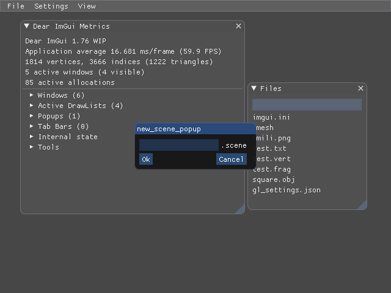

<h1 align="center" style="border-bottom:0">
  

    
    Triangle Engine
  

  

    a C++ Game Engine
  

  

    
[Manifesto](misc/docs/manifesto.md)

[Compilation](misc/docs/compiling.md)

  

</h1>

I've been meaning to make my own game engine for years now. Ever since using Unity3D I've always felt like I needed more control. This project is the answer to that:

Summing up all my knowledge of C++ over the years. This engine will stitch up multiple libries like _SDL2, Assimp, Cereal, SOIL_ as well as the OpenGL loader _Glad_ to create a simple but powerful game creation platform that suits my purposes. It will be a colossal task and an equaly immense learning oportunity.

One of the things I aim to overcome is my utter lack to plan ahead and set goals. I shall be tackling that issue with text file `idea.txt` and the various planning tools Github has to offer, **Projects**, **Issues**, **Pull Requests**, and **Branches**. I will, define a feature to implement in Projects, order by time estimated, then execute based on the most critical feature needed.

## To compile/run the engine yourself clone the repo and [compile](misc/docs/compiling.md).

## Progress

<b>Day 1</b>

<b>Day 3</b>

<b>Day 10</b>

Trying to get the textures working: 

<b>Day 25</b>

Now compiles for Ubuntu 18.04 as well as Archlinux and is configurable to use OpenGL Core 3.0 or 4.5:

|             Main             |          New Scene           |
| :--------------------------: | :--------------------------: |
|  |  |

<!-- 
<b>Day 30</b>

 -->

<b>Day 33</b>

<b>Day 49</b>

A huge range of improvement from serailizing to getting the textures finally working. As well as dynamic project reloading:

|           Textures           |          Color Edit          |
| :--------------------------: | :--------------------------: |
|  |  |

 
